# 如何从零开发游戏引擎

## ！！重要！！

* 添加脚本的内容没做完，问题在于SceneHierarchy中，无法获取到**选中**的entity的脚本的uuid,也即SelectionManager::GetSelections无法获取到
* 物理可能用bullet3简单模拟一下，后续主要使用引擎尝试常见的渲染，最好将渲染器再完善（数据统计)
* 整体来看，渲染器>脚本系统>基础知识总结>资源系统>其它（ui能做出明显区分即可)


## 开发前的准备知识
### 游戏引擎概述
### 证书与版权
[如何选择开源许可证？ - 阮一峰的网络日志 (ruanyifeng.com)](http://www.ruanyifeng.com/blog/2011/05/how_to_choose_free_software_licenses.html)
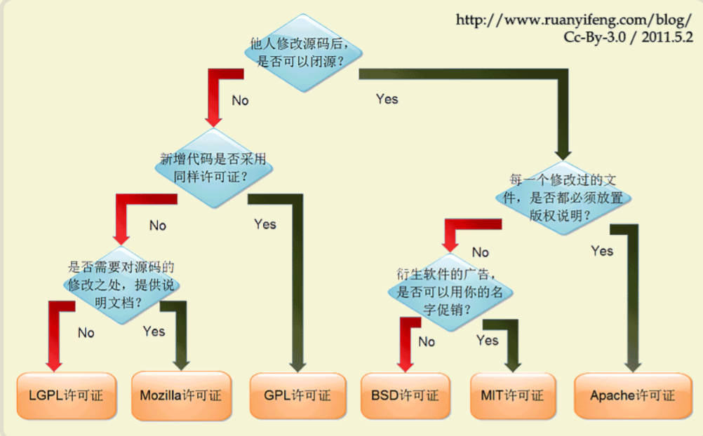

### 软件安装问题（日志）

* 原项目使用VS2019+C17，目前更新到VS2022。
  1. 安装VS2022需要在installer查看是否有标准库的的勾选，否则引起`#include<windows.h>`等失败。（Windows Kits/10/Include/um/ 中）
  2. 注册表还是不要更改的好，必要使用软链接。vs属性/常规/include sdk需要读取注册表的MDK值。
  3. windows sdk可以在installer下载，也可以在官网下载，win10不要用win11的sdk(2022默认下载win11 sdk)

## 项目管理

### CMake

#### CMake基础

CMake是一个工程文件生成工具。用户可以使用预定义好的CMake脚本，根据自己的选择（像是Visual Studio, Code::Blocks, Eclipse）生成不同IDE的工程文件。

\1. Debug

\2. MinSizeRel

\3. RelWithDebInfo

\4. Release

**基础指令**

```cmake
# 1. 指定最小cmake版本
cmake_minimum_required(VERSION 3.8)

# 2. 当前项目名称
project(Demo)

# 3. 指定头文件搜索路径,方便编译器找到头文件
include_directories("../include/")

add_definitions(-DDEBUG_MODE)

# 4. set设置变量代替值
set(EXECUTABLE_OUTPUT_PATH ../bin)

# 5. 表示用后面的文件生成名叫DemoApp的可执行文件
# 添加 普通可执行目标文件，导入可执行目标文件(例如导入git外部项目)，别名可执行目标文件
add_executable(DemoApp main.cpp Hello/hello.h Hello/hello.cpp)

# 6. 将指定源文件生成库文件
add_library(lib_name STATIC/SHARED Source)

# 7. 为指定的二进制可执行文件或者库 链接其它库
target_link_library(target_name lib1 lib2)
# - 补充
link_directories("../bin/")
link_libraries("opencv_world455d.lib")

# 8. 添加子目录，绝对相对路径均可
add_subdirectory(dir_name)

# 9. 添加指定目录下的所有源文件
# 但是头文件并没有被包括进去，若在头文件有函数的实现部分，采用这种方式就容易出问题
aux_source_directory(dir_name var_name)

# - 包含当前文件 GLOB_RECURSE(+包含子目录)
file(GLOB_RECURSE ALL_SOURCE "*.cpp" "*.c")
file(GLOB_RECURSE ALL_HEAD "*.hpp" "*.h")

# 10. 打印日志
message(FATAL_ERROR/WARNING/STATUS/DEBUG "message text")

# 11. 查找第三方库 EXACT必须精确匹配，QUIET禁止警告信息，REQUIRED没找到就终止CMAKE
# 一旦找到库会自动生成以下变量
# <NAME>_FOUND,<NAME>_INCLUDE_DIRS/<NAME>_INCLUDES,<NAME>_LIBRARIES/<NAME>_LIBS
find_package(package_name version EXACT/QUIET/REQUIRED)

# 12. 读，搜索，修改，排序
list()

# 13. 判断语句
if,elseif,endif

# 14. 循环
foreach,endforeach

# 15. Cmake中预定义的变量，例如
PROJECT_NAME
PROJECT_SOURCE_DIR # 包含Project指令的CMakeLists.txt所在目录

# ========Boundary======以下为拓展==========Boundary============
# 16. source_group
# 为源文件分配 group
source_group("Hello" FILES Hello/hello.h Hello/hello.cpp)
source_group("" FILES main.cpp)

# 17. set_target_properties 的作用是设置目标的属性，可以是目标文件输出的名称或者目录、目标文件的版本号。与之对应的，我们可以使用 get_target_properties 来获取目标文件某一属性对应的值。
set_target_properties(target_file1 target_file2 ...
                      PROPERTIES 
                      property_name1 value1 property2 value2 ...)                 
```

**示例**

```cmake
cmake_minimum_required (VERSION 3.8)
project ("OpenGLTest")
include_directories(${PROJECT_SOURCE_DIR}/include)
link_directories(lib)
set(CMAKE_ARCHIVE_OUTPUT_DIRECTORY_DEBUG ${CMAKE_BINARY_DIR}/lib)
set(CMAKE_LIBRARY_OUTPUT_DIRECTORY_DEBUG ${CMAKE_BINARY_DIR}/lib)
set(CMAKE_RUNTIME_OUTPUT_DIRECTORY_DEBUG ${CMAKE_BINARY_DIR}/bin)
set(CMAKE_ARCHIVE_OUTPUT_DIRECTORY_RELEASE ${CMAKE_BINARY_DIR}/lib)
set(CMAKE_LIBRARY_OUTPUT_DIRECTORY_RELEASE ${CMAKE_BINARY_DIR}/lib)
set(CMAKE_RUNTIME_OUTPUT_DIRECTORY_RELEASE ${CMAKE_BINARY_DIR}/bin)
file(COPY "lib" DESTINATION ${CMAKE_BINARY_DIR})
file(GLOB_RECURSE  src_dir "./src/*.c" "./src/*.h" "./src/*.cpp" )
add_executable (OpenGLTest "OpenGLTest.cpp" "OpenGLTest.h" ${src_dir})
target_link_libraries(OpenGLTest glfw3  opengl32)
```

#### CMakeSettings.json

参考：[CMakeSettings.json 架构参考 | Microsoft Learn](https://learn.microsoft.com/zh-cn/cpp/build/cmakesettings-reference?view=msvc-170)

文件包含 Visual Studio 为 IntelliSense 使用的信息，并为指定的配置和编译器环境构造它传递给 CMake 的命令行参数*`CMakeSettings.json`*。 配置指定适用于特定平台和生成类型的属性，例如 `x86-Debug` 或 `Linux-Release`。 每个配置都指定一个环境，该环境封装有关编译器工具集的信息，例如 MSVC、GCC 或 Clang。 CMake 使用命令行参数为项目重新生成根 文件和其他项目文件*`CMakeCache.txt`*。 可以在 文件中覆盖这些值*`CMakeLists.txt`*。

示例

```json
{
  "configurations": [
    {
      "name": "x64-Debug",
      "generator": "Ninja",
      "configurationType": "Debug",
      "inheritEnvironments": [ "msvc_x64_x64" ],
      "buildRoot": "${projectDir}\\out\\build\\${name}",
      "installRoot": "${projectDir}\\out\\install\\${name}",
      "cmakeCommandArgs": "",
      "buildCommandArgs": "",
      "ctestCommandArgs": ""
    },
    {
      "name": "x64-Release",
      "generator": "Ninja",
      "configurationType": "RelWithDebInfo",
      "buildRoot": "${projectDir}\\out\\build\\${name}",
      "installRoot": "${projectDir}\\out\\install\\${name}",
      "cmakeCommandArgs": "",
      "buildCommandArgs": "",
      "ctestCommandArgs": "",
      "inheritEnvironments": [ "msvc_x64_x64" ],
      "variables": []
    }
  ]
}
```


#### 用vs2019打开2022项目

`call cmake -B build -G "Visual Studio 17 2022" -T v143`

`call cmake -B build -G "Visual Studio 16 2019" -T v142`

### Premake5
无论是自己在开发时需要对项目的各个模块进行配置，还是别人clone自己的项目需要方便自动生成解决方案自动配置，都离不开premake的管理
[premake下载地址](https://premake.github.io/download/)
必要时可以查询premake官方文档。

#### 编写premake5.lua文件
以下为premake会使用到的基本语法
```lua
-- 最终解决方案的名称，一般习惯写成整个项目文件夹的名称
workspace "Aspect"
	-- 解决方案与各项目配置文件生成路径
	-- location "prj"
	-- 指定语言
	language "C++"
	-- 指定架构 x64 或 x86 或  x86_64
	architecture "x64"
	-- 配置类型,Distribution就是带了企业证书的release版本
	configurations {"Debug","Release","Dist"}


	-- 针对Debug配置类型的参数设置
	filter {"configurations:Debug"}
		symbols "On"
	-- 针对Release配置类型的参数设置
	filter {"configurations:Release"}
		optimize "On"
	-- 重置过滤器的其他设定
	filter {}

    -- 输出文件夹的名称(自定义)
    -- 编译(构建)方式-操作系统-CPU指令集架构
    -- 如Debug-Windows-x84_64
    outputdir = "%{cfg.buildcfg}-%{cfg.system}-%{cfg.architecture}"

    -- 输出文件包括两类
	-- 1. 目标文件。%{prj.name}为内置的宏，指项目的名称，如后面的ExampleDll，App等，类似于lib和dll的文件
	targetdir ("build/target/%{prj.name}/%{cfg.longname}")
	-- 2. 中间文件生成路径
	objdir ("build/obj/%{prj.name}/%{cfg.longname}")

	-- 编译后命令行，将目标文件拷贝至bin文件夹，因为其他模块build后生成的dll需要放到指定文件夹才能被调用
	postbuildcommands{
		("{COPY} %{cfg.buildtarget.relpath} \"../bin/\"")
	}
	
-- 定义函数，包含glfw三方库头文件，可被其他工程调用
function includeGLFW()
	includedirs "3rd/glfw/include"
end
-- 定义函数，链接glfw三方库
function linkGLFW()
	-- 指定lib的文件路径
	libdirs "3rd/glfw/lib-vc2019"
	-- 指定lib文件名，即glfw3dll.lib，此处使用的是动态库
	links "glfw3dll"
end

-- ExampleDll项目
project "ExampleDll"
	-- 类型为动态库项目
	kind "SharedLib"
	-- 代码文件，即ExampleDll文件夹下的所有文件
	files "src/ExampleDll/**"
	-- 包含glfw头文件
	includeGLFW()
	-- 链接glfw三方库
	linkGLFW()

-- 定义函数，链接ExampleDll动态库
function useExampleDLL()
	includedirs "src/ExampleDll"
	links "ExampleDll"
end

-- App应用程序
project "App"
	-- 类型为控制台程序
	kind "ConsoleApp"
	-- 代码文件
	files "src/App/**"
	-- 链接ExampleDll动态库
	useExampleDLL()
	-- windows平台使用OpenGL需链接OpenGL32
	filter "system:windows"
		links {"OpenGL32"}

-- 定义函数，包含Catch
function includeCatch()
	includedirs "3rd/Catch/Include"
	-- 预定义宏，C++版本为C++11及以上
	defines "CATCH_CPP11_OR_GREATER"
end

-- UnitTests单元测试项目
project "UnitTests"
	-- 类型为控制台程序
	kind "ConsoleApp"
	-- 代码文件
	files "src/UnitTests/**"
	-- 包含Catch
	includeCatch()
	-- 链接ExamleDll
	useExampleDLL()

```
#### 设计项目结构，利用premake5进行生成管理
整个项目文件夹命名为Aspect
**子项目有**
* Aspect: 用于存储引擎c++核心代码
* Aspectnut: 用于存储c++编辑器代码和C#项目代码
* Sandbox: 用于存储c++2d和3d的窗口代码
* Aspect-ScriptCore: 用于存储C#核心代码

**使用的第三方库有**
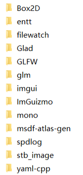

**实际管理方法**
* premake5.lua.exe放在根目录/vendor/premake/bin/下面。
* 为上述子项目每个项目都新建premake5.lua文件，并用项目根目录下的premake5.lua用来管理这些子项目。
* 依赖了很多第三方库，为避免premake5.lua显得臃肿，这里将依赖独立出一个文件Dependencies.lua。
然后使用`include "Dependencies.lua"在项目根目录下引用
```lua
VULKAN_SDK = os.getenv("VULKAN_SDK")

IncludeDir = {}
IncludeDir["VulkanSDK"] = "%{VULKAN_SDK}/Include"
IncludeDir["GLFW"] = "Aspect/vendor/GLFW/include"
IncludeDir["Glad"] = "Aspect/vendor/Glad/include"
IncludeDir["ImGui"] = "Aspect/vendor/imgui"
IncludeDir["filewatch"] = "Aspect/vendor/filewatch"
IncludeDir["glm"] = "Aspect/vendor/glm"
IncludeDir["stb_image"] = "Aspect/vendor/stb_image"
IncludeDir["entt"] = "Aspect/vendor/entt/include"
IncludeDir["yaml_cpp"] = "Aspect/vendor/yaml-cpp/include" -- 用yaml_cpp下划线是因为"%{IncludeDir.yaml_cpp}"只认识_ 不认识-
IncludeDir["Box2D"] = "Aspect/vendor/Box2D/include"
IncludeDir["ImGuizmo"] = "Aspect/vendor/ImGuizmo" 

IncludeDir["mono"] = "Aspect/vendor/mono/include" -- 手动生成

IncludeDir["msdfgen"] = "%{wks.location}/Aspect/vendor/msdf-atlas-gen/msdfgen"
IncludeDir["msdf_atlas_gen"] = "%{wks.location}/Aspect/vendor/msdf-atlas-gen/msdf-atlas-gen"

-- Library's directory
LibraryDir = {}
-- %{wks.location}获取当前项目.sln的路径
-- %{cfg.buildcfg}表示当前编译目标是Debug还是Release
LibraryDir["mono"] = "%{wks.location}/Aspect/vendor/mono/lib/%{cfg.buildcfg}" 

LibraryDir["VulkanSDK"] = "%{VULKAN_SDK}/Lib"

-- Concrete Library
Library = {}
Library["mono"] = "%{LibraryDir.mono}/libmono-static-sgen.lib" -- 主要是这个

Library["Vulkan"] = "%{LibraryDir.VulkanSDK}/vulkan-1.lib"
Library["VulkanUtils"] = "%{LibraryDir.VulkanSDK}/VkLayer_utils.lib"

Library["ShaderC_Debug"] = "%{LibraryDir.VulkanSDK}/shaderc_sharedd.lib"
Library["SPIRV_Cross_Debug"] = "%{LibraryDir.VulkanSDK}/spirv-cross-cored.lib"
Library["SPIRV_Cross_GLSL_Debug"] = "%{LibraryDir.VulkanSDK}/spirv-cross-glsld.lib"
Library["SPIRV_Tools_Debug"] = "%{LibraryDir.VulkanSDK}/SPIRV-Toolsd.lib"

Library["ShaderC_Release"] = "%{LibraryDir.VulkanSDK}/shaderc_shared.lib"
Library["SPIRV_Cross_Release"] = "%{LibraryDir.VulkanSDK}/spirv-cross-core.lib"
Library["SPIRV_Cross_GLSL_Release"] = "%{LibraryDir.VulkanSDK}/spirv-cross-glsl.lib"

-- Windows
Library["WinSock"] = "Ws2_32.lib"
Library["WinMM"] = "Winmm.lib"
Library["WinVersion"] = "Version.lib"
Library["BCrypt"] = "Bcrypt.lib"
```
* 以下仅以Aspect子项目的premake.5.lua为例
```lua
project "Aspect"
kind "StaticLib"
language "C++"
cppdialect "C++17"
-- On:代码生成的运行库选项是MTD,静态链接MSVCRT.lib库;
-- Off:代码生成的运行库选项是MDD,动态链接MSVCRT.dll库;打包后的exe放到另一台电脑上若无这个dll会报错
staticruntime "off" --TODO: to be fixed

targetdir ("%{wks.location}/bin/" .. outputdir .. "/%{prj.name}")
objdir ("%{wks.location}/bin-int/" .. outputdir .. "/%{prj.name}")

pchheader "aspch.h"
pchsource "src/aspch.cpp"

files
{
    "src/**.h",
    "src/**.cpp",
    "vendor/stb_image/**.h",
    "vendor/stb_image/**.cpp",
    "vendor/glm/glm/**.hpp",
    "vendor/glm/glm/**.inl",
    "vendor/filewatch/**.h",
    "vendor/ImGuizmo/ImGuizmo.h",
    "vendor/ImGuizmo/ImGuizmo.cpp"
}

defines{
    "_CRT_SECURE_NO_WARNINGS"，
    "GLFW_INCLUDE_NONE"
}

includedirs
{
    "src",
    "vendor/spdlog/include",
    "%{IncludeDir.GLFW}",
    "%{IncludeDir.Glad}",
    "%{IncludeDir.ImGui}",
    "%{IncludeDir.glm}",
    "%{IncludeDir.stb_image}",
    "%{IncludeDir.entt}",
    "%{IncludeDir.yaml_cpp}",
    "%{IncludeDir.Box2D}",
    "%{IncludeDir.mono}",
    "%{IncludeDir.msdf_atlas_gen}",
    "%{IncludeDir.msdfgen}",
    "%{IncludeDir.filewatch}",
    "%{IncludeDir.VulkanSDK}",
    "%{IncludeDir.ImGuizmo}"
}

links
{
    "GLFW",
    "Glad",
    "ImGui",
    "yaml-cpp",
    "msdf-atlas-gen",
    "opengl32.lib",
    "Box2D",
    "%{Library.mono}"
}

-- imguizmo 
filter "files:vendor/ImGuizmo/**.cpp"
flags { "NoPCH" }

-- 如果系统是windows
filter "system:windows"
    --staticruntime "On"
    -- windows SDK 版本
    systemversion "latest"

    links{
        "%{Library.WinSock}",
        "%{Library.WinMM}",
        "%{Library.WinVersion}",
        "%{Library.BCrypt}",
    }

    defines
    {
        "AS_PLATFORM_WINDOWS",
        "AS_BUILD_DLL",
        "GLFW_INCLUDE_NONE"
    }

    --postbuildcommands
    --{ --动态链接不需要copy dll了
    --	("{COPY} %{cfg.buildtarget.relpath} ../bin/" .. outputdir .. "/Sandbox")
    --}

filter "configurations:Debug"
    defines "AS_DEBUG"
    runtime "Debug"
    symbols "on"

    links{
        "%{Library.ShaderC_Debug}",
        "%{Library.SPIRV_Cross_Debug}",
        "%{Library.SPIRV_Cross_GLSL_Debug}"
    }

filter "configurations:Release"
    defines "AS_RELEASE"
    runtime "Release"
    optimize "on"

    links{
        "%{Library.ShaderC_Release}",
        "%{Library.SPIRV_Cross_Release}",
        "%{Library.SPIRV_Cross_GLSL_Release}"
    }

filter "configurations:Dist"
    defines "AS_DIST"
    runtime "Release"
    optimize "on"
    links{
        "%{Library.ShaderC_Release}",
        "%{Library.SPIRV_Cross_Release}",
        "%{Library.SPIRV_Cross_GLSL_Release}"
    }
```
* 
#### 补充知识
##### x86,x64,x86-64,amd64,arm指令集架构之间的关系
* 所谓CPU指令集，就是硬件对外提供的接口，本质上是机器语言。应用程序依赖操作系统的调度，操作系统让硬件计算基本的加法乘法。而这个指令集分为不同的架构。

* 指令集可以分为复杂和精简两类。分别以x86和arm为代表。硬件复杂，软件代码自然就简洁。

* x86
  * x86最先出现在8086中央处理器中(CPU),8086是16位，x86经过改进可以支持32位，现在认为x86架构就是32位架构。
  * Intel制造了x86,授权给amd(超威半导体),amd做出了支持64位的x86,称为amd64;后面Intel推出Intel64与之兼容。现在的x86-64,x86_64，x64,amd64这些称呼基本是指一个东西。（并且都兼容32位的x86）
  
* arm
  * 作为简单指令集架构，主要应用在手机上。
  
  * arm公司采用授权方式盈利，详情见以下链接
  
    参考：
1. https://zhuanlan.zhihu.com/p/113157931
2. https://dongka.github.io/2018/11/17/cpu/arm%E4%BD%93%E7%B3%BB%E6%9E%B6%E6%9E%84%E7%9A%84%E5%8F%91%E5%B1%95/

##### Debug和Release的区别
* Debug(调试版本)下的编译结果包括了调试信息，为开发者提供调试能力
* Release(发布版本)编译结果不包括调试信息，往往进行过各种优化，为用户提供便利的体验。
* VS中提供了这两种编译选项，我们也可以自定义。

**Runtime Library的设置**
* 什么是Runtime Library?**运行时所需要的库文件**
C Runtime Library 简称CRL为C，C++提供库文件；还有 .Net Runtime Library。
* 程序使用库文件有两种方法，一种是**static linking**,一种是**dynamic linking**。
  * static linking是将.lib文件全部复制到程序里，所以运行时很快，但是需要频繁复制，不同程序/模块需要独自复制，即使有些代码用不上。
  * dynamic linking则是将.dll加载进程序，好处是不同程序和模块都可以共享同一份.dll,但是这种方式本身很慢，适合需要频繁更新的项目。
  * **【注意】：** **如果子项目Aspect静态链接第三方库imgui,最终imgui.lib会直接复制到Aspect,但是子项目Sandbox动态加载子项目Aspect,Aspect会生成Aspect.dll文件，而问题是imgui是静态链接的，无法生成到Aspect.dll,最后Sandbox就会找不到imgui**
  方法1：
  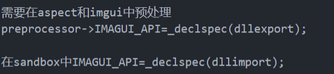
  方法2：使用一个.def模块定义文件，其中列出了我们要从ImGui导出的所有函数，但是会很麻烦。
  
* VS中Runtime Library的设置
  * 多线程调试Dll (/MDd) 对应的是MD_DynamicDebug
  * 多线程Dll (/MD) 对应的是MD_DynamicRelease
  * 多线程(/MT) 对应的是MD_StaticRelease
  * 多线程(/MTd)对应的是MD_StaticDebug
  
  **前两个已废弃。**

**premake中的staticruntime设置**
On:代码生成的运行库选项是MultiThreaded,release下的静态库
Off:设置选项为MultiThreadedDLL，release下的动态库

**这里有两个概念之间需要辨析：**
kind "StaticLib"指的是当前项目会build成.lib文件
而 staticruntime "on"指的是该项目在生成.lib或者.dll时需要指定的运行库，上图中有对应介绍。
两者不是同一个东西。

##### 项目核心代码Aspect的build设置
**1. 讨论**
**论点1**

lib所有链接都构建到exe文件中

dll的优点

* 热更新，更改引擎代码后只需重新编译dll，让多个测试项目不用重新编译能使用最新引擎代码，让客户端的链接更容易

  缺点

* dll很多警告，exe动态链接dll启动速度慢

游戏引擎无需热更，核心代码开发好了不会更改。显然静态链接的方式会更合适。
**论点2**
Aspect.dll上创建的变量，Sandbox.exe上释放会出错，因为两者都有各自的堆(heap),释放一定要交给Aspect.dll来做。

* 使用Aspect.lib能够解决问题。
* 当然也可以将生成Aspect.dll的Runtime Library设置成/MD(d),通过动态运行库来生成Aspect.dll(staticruntime "off")

**综合考虑得出结论，设置premake中kind "StaticLib"，staticruntime "off",最后生成Aspect.lib。**
**注意**之前提到过，见下图
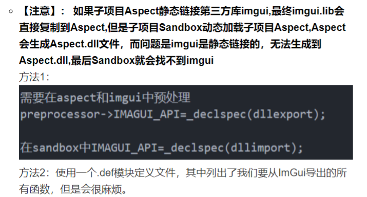
其实也表明了使用Aspect.dll的不便之处。

**2. 结论**
 **整个项目的结构 Sandbox(客户端) --静态链接-- Aspect.lib(核心代码)/Aspectnut.lib(编辑器) --静态链接-- ImGui.lib(这里可以是其他第三方库)**


#### 使用python脚本下载第三方库+bat脚本辅助构建解决方案
要使得他人能够一键安装第三方库，并且一键构建解决方案，需要借助脚本的力量。
TODO:

### 项目Build&Run

* GLFW的子模块添加(与TheCherno的版本不一样)

`git checkout -f b4b4319`

* imgui版本也是老版本，在原项目上查看commit版本号（这里因为代码的杂糅，还是不适用此老版本，参考了hengine)

### Git

#### Part1:配置

```shell
# 1. 免密登录
ssh-keygen -t rsa
# 2. 配置在安装目录
git config --system --list   下
# 3. 在c盘中，用户的配置，账号
git config --global --list   

# 4. 删除c盘下的`git.config`内容,此时global为空
git config --global user.name "aspect-ux"  #配置用户
git config --global user.email "xxxxxxxxxx@qq.com" #配置邮箱
```

#### Part2:理论

**git是世界先进的分布式版本控制系统**

**首先要明确：**

所有的版本控制系统，只能跟踪**文本文件**的改动，比如txt文件，网页，所有程序的代码等，Git也不列外，版本控制系统可以告诉你每次的改动。

但是图片，视频这些二进制文件，虽能也能由版本控制系统管理，但没法跟踪文件的变化，只能把二进制文件每次改动串起来，也就是知道图片从1kb变成2kb，但是到底改了啥，版本控制也不知道。

**git管理流程图**

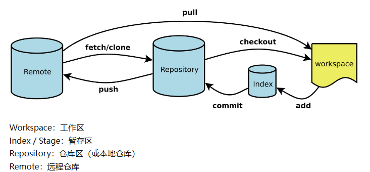

**`.gitignore`文件写法**

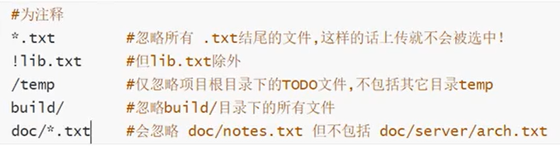

#### Part3:实践

**拉取流程**

* `git pull [branch]`   从远程仓库到本地仓库
* git reset     		从本地仓库 到Stage
* git  checkout     从Stage到工作目录

**以下为实用的案例**

注意假设当前在项目**master**分支下

* 创建分支

  ```shell
  # 拿到一个项目
  # 1.先拉取remote确保当前已经是最新代码
  git pull origin master
  
  # 2.新建分支并切换,这里名字为wendy
  git branch wendy
  git checkout wendy
  #   可以用下面一行完成
  git checkout -b wendy
  ```

* 提交流程

  ```shell
  # 1. 查看改动
  git status
  # 2. 添加到暂存区stage/index
  git add .
  # 3. 从暂存区提交到本地仓库
  git commit -m 'annotation'
  # 4. 从本地仓库提交到remote repository
  git push origin wendy # 直接可能报错
  #    这里直接提交到了wendy分支，有时候，在你提交之前，远程代码已经改变了，
  #    此时会发生你的代码落后远程，执行rebase master，然后重新push
  #    如果是push到分支master上，也是要rebase master的。
  #    需要注意master是默认的最新的且stable的代码。
  git pull --rebase origin master # 总之养成好习惯，push之前先rebase或pull一下，自己的更改不会丢失，如果发生冲突也好改
  git push origin wendy
  
  # 5. PR操作
  # 此时可以在github或gitee上新建Pull Request,请求合并wendy到master
  ```

  **举例**

  * 我在.gitignore文件中删除了`/[Aa]ssets/[Ss]treamingAssets/aa/*`

  * 然后rebase，发现远程版本比我多加了一行`## test rebase`

  * 如下图，发生了冲突，HEAD指向当前分支，等号上面是本地提交，等号下面是远程的更改。由于使用了rebase远程的更改也在等号上；如果只使用pull，远程更改会留在等号下。详细冲突解决方法见下面。

  

  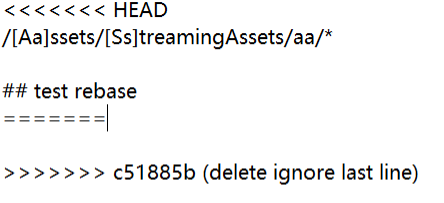

  

* 冲突解决方法

  ```shell
  # rebase解决冲突流程，假设远程master的代码stable 且 newest
  # 1. rebase master检查是否冲突
  git pull --rebase origin master
  # 2. 更正完成后添加到stage暂存区
  git add .
  # 3. 注意，有时候可能在更正的时候无意增加了新的更改，例如多回了一下车，多一行空行之类的;又或者检验是否更正完成，我们往往需要进一步rebase
  git rebase --continue
  git pull --rebase origin master #继续检验,没有问题下一步
  # 4. push
  git push origin wendy #这一步也可能冲突，要知道本地远程信息不一样总会有这样的问题，但是注意，既然已经到了push的阶段，意味着本地仓库已经是最新的有效代码，所以
  git push -f origin wendy # 强制推送覆盖远程代码
  ```

* 子模块

  ```shell
  # 1. 添加子模块
  git submodule add <url> src/vendor
  # 2. update子模块
  git submodule update
  # git clone --recursive因网络不好导致子模块没有下载全
  git submodule update --init --recursive
  
  # 3. delete submodule
  #  3.1 -删除子模块目录 -删除.gitmodules条目 -删除.git下的config和module
  #  3.2 如果上述操作仍然失败，执行如下命令
  git rm --cached [submodule path]
  # 注：保证.gitignore的更改到commit里
  ```

* 版本回退

  ```shell
  # 查看历史版本号
  git reflog
  git reset <id>
  ```

* 删除及其它操作

  ```shell
  # 1. 删除分支
  git branch -d wendy
  # 2. 删除远程分支
  git push origin --delete wendy
  # 3. 查看分支
  git branch
  # 4. 查看commit记录
  git log
  ```

* 共用分支的情况

  ```shell
  # 有时候我们可能直接共用分支,
  git fetch origin wendy : wendy #与克隆等同
  ```

* ignore没写好，导致多余的文件上传了

  ```shell
  # 1. 检查是否和远程冲突
  git pull
  # 2. 删除本地缓存
  git rm -r --cached .
  # 3. 重新上传(全部)
  # git add/commit -m"update ignorefile"/push
  
  ```

  

## 基础知识

### 0.前置知识

#### 0.1 What's Game Engine

* 矩阵的技术支持
* 创造的高效工具
* 复杂的艺术

### 1.游戏引擎架构&Games104

#### 1.1 基础架构

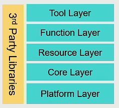

* Everything is an object
* GameObject + Component模式  **(创建游戏对象)**

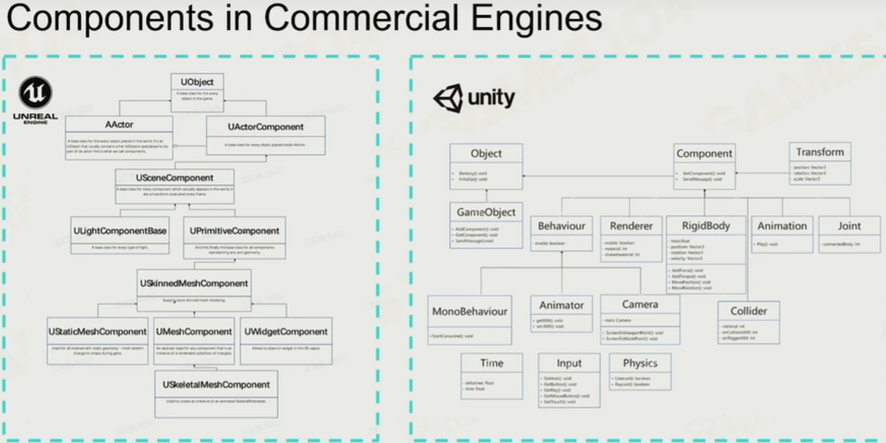

* Component based tick(每帧更新） System based tick按照“系统”(ecs)更新) 现代主要是这两种

也有object based tick. **(更新)**

* Events 事件机制，炮弹要炸，检测周围对象，实现影响，如果大量使用if不合理。这里使用观察者模式(observer pattern-又叫订阅者模式)，将发生的事件储存起来，以邮件或广播的形式发送，等到下一个系统的tick统一处理，进而避免一个一个检测。**(事件)**

* Scene Management(**场景管理**) 关于一个场景中玩家视角的GO内容和视角外的GO管理。

  八叉树画格子。


按下按钮，触发动画事件，动画又tick 物理... 需要理清这些事件是在同一帧发生还是后一帧发生。


一般来说逻辑先于渲染

#### 1.2 渲染实践

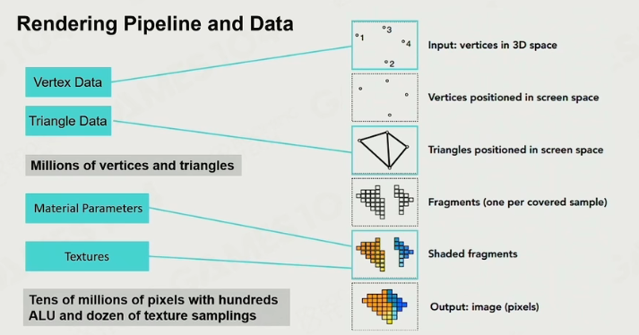

躲在像素后的men and women

projection + shading


**认识显卡(GPU)**

SIMD and SIMT

SIMD (Single Instruction Multiple Data) 通俗来说就是计算矩阵加法(乘法)，同时计算四个分量。指令并行技术。

**SIMT(~Multiple Thread) **顾名思义，同时计算多个矩阵运算

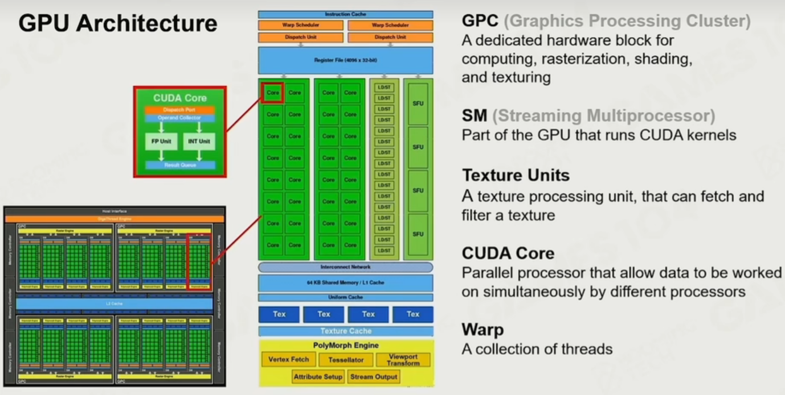

**材质与网格**

Submesh和Mesh，Submesh只引用了vertextbuffer中一小段，方便一个模型多个材质。

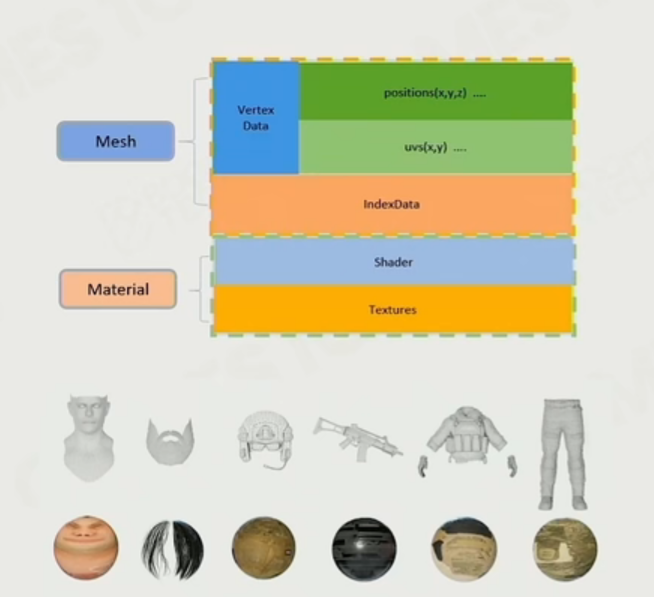


**使用Handle来管理资源**

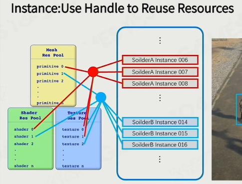

**Cluster-Based Mesh Pipeline**


### 2. 平台层与图形API

#### 2.1 OpenGL介绍

参考：

1. [learnopengl](https://learnopengl-cn.github.io)
2. [glad.dav1d.de](https://glad.dav1d.de/)
3. https://github.com/TheCherno/imgui

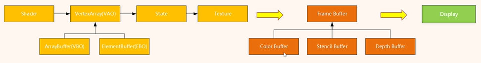

**OpenGL介绍：**

* OpenGL早期采用immediate mode(也就是固定渲染管线)，在OpenGL3.3后推荐采用核心模式(Core-profile)开发，具有更强的灵活性，更进一步控制计算和OpenGL绘制。

* OpenGL自身是一个巨大的状态机(State Machine)：一系列的变量描述OpenGL此刻应当如何运行。OpenGL的状态通常被称为OpenGL上下文(Context)。我们通常使用如下途径去更改OpenGL状态：设置选项，操作缓冲。最后，我们使用当前OpenGL上下文来渲染。

* OpenGL中的对象(object)代表上下文的子集,把上下文看作结构体，对象就是一个数据元素

  常用工作流：**创建对象->绑定对象->设置状态->解绑**

  ```c++
  // OpenGL的状态
  struct OpenGL_Context {
      ...
      object* object_Window_Target;
      ...     
  };
  // 工作流示例
  // 创建对象
  unsigned int objectId = 0;
  glGenObject(1, &objectId);
  // 绑定对象至上下文
  glBindObject(GL_WINDOW_TARGET, objectId);
  // 设置当前绑定到 GL_WINDOW_TARGET 的对象的一些选项
  glSetObjectOption(GL_WINDOW_TARGET, GL_OPTION_WINDOW_WIDTH, 800);
  glSetObjectOption(GL_WINDOW_TARGET, GL_OPTION_WINDOW_HEIGHT, 600);
  // 将上下文对象设回默认
  glBindObject(GL_WINDOW_TARGET, 0);
  ```

* OpenGL对应的库是c语言编写，这里使用了同样c语言编写的GLFW库为我们创建窗口，设置OpenGL上下文状态等。这部分OpenGL抽象了出来，没有实现，使得在不同平台有不同方法。

**OpenGL使用**

* 对象是上下文的一部分，拿绘制三角形举例，需要引入三个对象

  * VAO,VBO,EBO/IBO  分别是顶点数组对象，顶点缓冲对象，元素/索引缓冲对象
  * OpenGL大部分在做的工作是将3d坐标转换成2d像素。这个处理过程叫做图形渲染管线（Graphics Pipline）整个渲染管线开发者主要控制 顶点数据输入->顶点着色器(几何阶段)->片元着色器(光栅化阶段)

* 以下用三角形举例

  ```cpp
  float vertices[] = {
      -0.5f, -0.5f, 0.0f,
       0.5f, -0.5f, 0.0f,
       0.0f,  0.5f, 0.0f
  };
  ```

  VAO+VBO

  ```CPP
  // 1. Create VAO&VBO
  unsigned int VBO, VAO;
  glGenVertexArrays(1, &VAO);
  glGenBuffers(1, &VBO);
  
  // 2. Bind VAO first,then Bind VBO + SetData(copy users' data to buffer)
  glBindVertexArray(VAO);
  
  glBindBuffer(GL_ARRAY_BUFFER, VBO);
  glBufferData(GL_ARRAY_BUFFER, sizeof(vertices), vertices, GL_STATIC_DRAW);
  
  // 3. Set VAP(顶点属性指针) and Enable
  //   第一个属性0代表顶点着色器的layout location =  0,顶点数据输入到顶点着色器
  //   第二个属性代表vec3
  glVertexAttribPointer(0, 3, GL_FLOAT, GL_FALSE, 3 * sizeof(float), (void*)0);
  glEnableVertexAttribArray(0);
  
  // note that this is allowed, the call to glVertexAttribPointer registered VBO as the vertex attribute's bound vertex buffer object so afterwards we can safely unbind
  glBindBuffer(GL_ARRAY_BUFFER, 0); 
  
  // You can unbind the VAO afterwards so other VAO calls won't accidentally modify this VAO, but this rarely happens. Modifying other
  // VAOs requires a call to glBindVertexArray anyways so we generally don't unbind VAOs (nor VBOs) when it's not directly necessary.
  glBindVertexArray(0); 
  
  ```

* 以下使用方形Quad举例(三角形中没有使用IBO,IBO用于顶点重用，绘制正方形不需要6顶点而是4顶点)

  ```CPP
  // 1. 设置顶点数组和indices(索引)数组
  float vertices[] = {
      0.5f,  0.5f, 0.0f,  // top right
      0.5f, -0.5f, 0.0f,  // bottom right
      -0.5f, -0.5f, 0.0f,  // bottom left
      -0.5f,  0.5f, 0.0f   // top left 
  };
  unsigned int indices[] = {  
      0, 1, 3,  // 用索引为0,1,3的三个顶点作为一个三角形
      1, 2, 3   // ...
  };
  
  // 2. Create VAO,VBO,EBO(生成对象) + VAO绑定，VBO绑定SetData,EBO绑定SetData
  unsigned int VBO, VAO, EBO;
  glGenVertexArrays(1, &VAO);
  glGenBuffers(1, &VBO);
  glGenBuffers(1, &EBO);
  
  glBindVertexArray(VAO);
  
  glBindBuffer(GL_ARRAY_BUFFER, VBO);
  glBufferData(GL_ARRAY_BUFFER, sizeof(vertices), vertices, GL_STATIC_DRAW);
  
  //  额外需要绑定元素/索引缓冲
  glBindBuffer(GL_ELEMENT_ARRAY_BUFFER, EBO);
  glBufferData(GL_ELEMENT_ARRAY_BUFFER, sizeof(indices), indices, GL_STATIC_DRAW);
  
  // 3. 设置顶点属性指针
  glVertexAttribPointer(0, 3, GL_FLOAT, GL_FALSE, 3 * sizeof(float), (void*)0);
  glEnableVertexAttribArray(0);
  
  // note that this is allowed, the call to glVertexAttribPointer registered VBO as the vertex attribute's bound vertex buffer object so afterwards we can safely unbind
  glBindBuffer(GL_ARRAY_BUFFER, 0); 
  
  // remember: do NOT unbind the EBO while a VAO is active as the bound element buffer object IS stored in the VAO; keep the EBO bound.
  //glBindBuffer(GL_ELEMENT_ARRAY_BUFFER, 0);
  
  // You can unbind the VAO afterwards so other VAO calls won't accidentally modify this VAO, but this rarely happens. Modifying other
  // VAOs requires a call to glBindVertexArray anyways so we generally don't unbind VAOs (nor VBOs) when it's not directly necessary.
  glBindVertexArray(0); // not unbind 
  
  // 上述是准备阶段，下面是每一次绘制调用
  // 1. use shader
  // 2. bind vertexarry
  // 3. gldrawelement
  ```

  以上完成了第一个阶段，顶点数据的输入。

  总结：VAO用于管理顶点属性指针，只要VBO和EBO/IBO的数据设置一次，后续都可以通过绑定和解绑VAO来绘制。不同的属性指针绘制不同的图形。而绘制的图形和顶点顺序由EBO/IBO决定。

  至此OpenGL使用基础结束

* 有关glad的使用

OpenGL函数定义在显卡中，大多数函数定义位置在编译时候位置无法确定，使用GLAD库在运行时查询保存在函数指针中

```c++
//OpenGLContext.Init
// 获取显卡中函数定义
int status = gladLoadGLLoader((GLADloadproc)glfwGetProcAddress);
AS_CORE_ASSERT(status, "Failed to initialize Glad!");
```

上面主要是opengl的基本原理和工作流。

以下则是更细节的应用。

**光照**

* Phong 光照模型 Ambient + Diffuse + Specular

**材质**

更细节的控制物体表面的视觉输出

下面是一个简单的材质结构体

```glsl
#version 330 core
struct Material {
    vec3 ambient;
    vec3 diffuse;
    vec3 specular;
    float shininess;
}; 

uniform Material material;
```

**光照贴图**

要想要更细节的材质，只是简单的光照模型无法满足。

我们引入光照贴图，主要是漫反射贴图和镜面反射贴图

只需通过采样就可以替代计算

```glsl
struct Material {
    sampler2D diffuse;
    vec3      specular;
    float     shininess;
}; 
...
in vec2 TexCoords;
```

**投光物(light caster)**

* directional light(方向光，定向光，平行光)，光源很远时，投射的光线接近于平行光
* point light(点光)
* spot light(聚光) 特点是方向固定圆锥形。
* Flash light(手电筒)

细节上，要注意光照的衰减，聚光的边缘平滑

多光源组合。


**模型加载**

assimp 是**Open Asset Import Library**开放资产导入库

一个模型根据不同模型部件(形状)分成多个网格，一个mesh(网格)是OpenGL绘制最小单位。

(顶点数据、索引和材质属)


**高级OpenGL**

* 深度测试

  深度缓冲(depth-buffer,z-buffer)存储了深度值，Depth Test开启后会比对深度并更新为最近的深度

  发生在fragment shader-> stencil test 之后

  虽然说存储的是深度，但不是观察空间的真实值，而是通过far - near映射到到0-1

  实践里深度值并不是通过线性映射成0-1，因为往往需要近处更精确，而远处则无需这么精确。

  **深度冲突**

  两个图形并排时，往往因为深度值精度不够，无法确定物体前后，使得两个物体交替出现，出现奇怪的花纹，称为z-fighting

  前面说过depth buffer深度值并非线性，距离近平面越远，精度越小，深度冲突无法完全被避免。

  **如何避免深度冲突**

  * 避免物体重合
  * 近平面离观察者远一些(但是不能太远导致近处物体被裁剪), 使得物体离近平面近一些。
  * 牺牲性能追求高精度深度缓冲(一般来说深度是24位，现在也有很多32位)

* 模板测试Stencil test

  同样是比对缓冲(stencil buffer)丢弃片段，发生在深度测试之前

  模板值是8位的，所以一个像素256种模板值

  一开始缓冲值会变成全0，后面逐步更新成1可以使得该像素保留渲染。同时我们可以自定义模板值，

  设定threshold决定是否丢弃。

  **使用** 一旦开始使用，更新模板值，然后保护模板值，之后就可以直接使用。

  **物体轮廓** 有色边框，例如游戏中选中物体的边框。单独用一个fragment shader，开启模板测试，不等于1才渲染。

* 混合Blending

  实现透明效果的技术

  使用图片告诉OpenGL需要使用图片的alpha通道

  ```cpp
  glTexImage2D(GL_TEXTURE_2D, 0, GL_RGBA, width, height, 0, GL_RGBA, GL_UNSIGNED_BYTE, data);
  ```

  比如渲染透明底的图片，默认OpenGL不知道如何解决透明问题，导致渲染出来是白底，所以要手动设置。

  glsl中,在fragment shader中使用discard可以使得片段不进入颜色缓冲，进而剔除掉白底，类似于unity中的alpha test；

  （当我们需要保留透明底时，需要设置纹理环绕方式，保证不是repeat)

  ```
  glTexParameteri( GL_TEXTURE_2D, GL_TEXTURE_WRAP_S, GL_CLAMP_TO_EDGE);
  glTexParameteri( GL_TEXTURE_2D, GL_TEXTURE_WRAP_T, GL_CLAMP_TO_EDGE);
  ```

  然而**最关键的还是半透明物体的渲染**

  经典的混合公式

  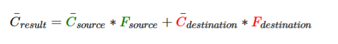

OpenGL有特定函数帮助设置源S，因子F的值。

**渲染顺序**

1. 先绘制所有不透明的物体。
2. 对所有透明的物体排序。
3. 按顺序绘制所有透明的物体。

* 面剔除

  保留Front Facing,剔除Back Facing

  三角图元顶点定义有一定顺序，称之为**环绕顺序**

  观察者 观察三角形，设正向为逆时针；对于背后的三角形来说反而从观察视角变成了顺时针。

  程序定义时，大家都是正向三角形，但实际观察(渲染)时，却发生变化。

  根据这个原理，可以使用OpenGL来实现面剔除

  ```cpp
  glEnable(GL_CULL_FACE);//开启
  glCullFace(GL_BACK);//剔除背面
  ```

* **帧缓冲**framebuffer

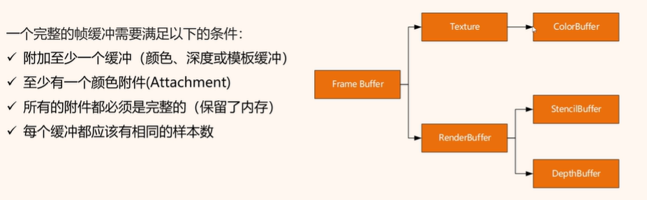

#### 2.2 DirectX 11

参考：

1. [回到首页 (directx11.tech)](https://directx11.tech/#/README?id=前言)
2. https://pthom.github.io/imgui_manual_online/manual/imgui_manual.html

使用了基本框架,使用ImGui需要查询Dear ImGui Demo窗口以及imgui_demo.cpp

TODO: ImGui sRGB修正

* cmake ctrl s(hlsl编译) + build(exe生成)


**基本概念**

* D3D设备(Device)代表显卡适配器(显卡)，主要用于创建资源(纹理，缓冲区，视图，着色器等)
* D3D设备上下文(Device Context),可看作渲染管线，用于渲染和计算，与设备一一对应。
* DXGI交换链(Swap Chain)缓存了单个或多个表面(离屏纹理)，这些表面被称作back buffer，通过页面翻转避免画面闪烁。
* Constant Buffer 常量缓冲区，HLSL概念，关键字为cbuffer,类似于全局常量。可以通过GPU和CPU两种数据更新方式，为适应频繁更新，采用CPU Dynamic动态更新,c++端定义结构体，与hlsl的常量缓冲区对应。

##### 绘制三角形

GameApp::Init()

```cpp
bool GameApp::Init()
{
    if (!D3DApp::Init())
    return false;

    // 从文件创建shader，绑定顶点布局
    if (!InitEffect())
        return false;

    // 【设备】 初始化三角形顶点，设置缓冲区Description并创建
    // 【上下文】设置数据和布局，绑定顶点和片元着色器，设置shader变量
    if (!InitResource())
        return false;

    return true;
}
```

GameApp::DrawScene

```cpp
void GameApp::DrawScene()
{
    assert(m_pd3dImmediateContext);
    assert(m_pSwapChain);
   
    static float black[4] = { 0.0f, 0.0f, 0.0f, 1.0f };    // RGBA = (0,0,0,255)
    m_pd3dImmediateContext->ClearRenderTargetView(m_pRenderTargetView.Get(), black);
    m_pd3dImmediateContext->ClearDepthStencilView(m_pDepthStencilView.Get(), D3D11_CLEAR_DEPTH | D3D11_CLEAR_STENCIL, 1.0f, 0);

    // 绘制三角形
    // Draw(vertexNum,firstIndexLocation);
    m_pd3dImmediateContext->Draw(3, 0);
    HR(m_pSwapChain->Present(0, 0));
}
```

##### RenderDoc调试

官网[RenderDoc](https://renderdoc.org/)

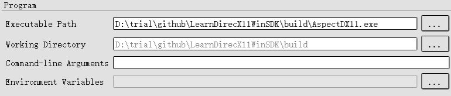

如果加载第三方动态库，需要添加Environment Variables

截帧完成后，可以通过Event Browser进行查看以下不同窗口

* 在Pipeline State窗口查看渲染管线 有哪些阶段是激活状态并查看详情。

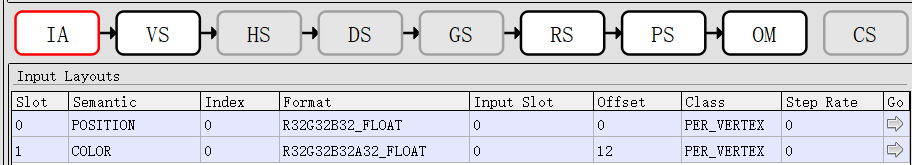

* 在Mesh Viewer查看模型线框和顶点数据

* 在Texture Viewer上查看输入的纹理，输出的渲染目标

  并且可以观察深度缓冲和模板缓冲的结果，还可以单像素debug

  Overlay选项可以查看当前深度测试或模板测试结果(绿色通过测试，红色没有通过)或其他信息。

* Resource Inspector可以查看绘制所用资源。

##### 绘制立方体Cube

##### 光照，几何模型，光栅化状态


#### 2.3 Vulkan

参考：

1. [Introduction - Vulkan Tutorial (vulkan-tutorial.com)](https://vulkan-tutorial.com/)
2. [SaschaWillems/Vulkan: Examples and demos for the new Vulkan API (github.com)](https://github.com/SaschaWillems/Vulkan)

### 3. 核心层

### 4. 资产层

### 5. 功能层

### 6. 工具层


## 项目内容

参考了：[刘建杰_Hazel游戏引擎,LearnOpenGL,数据结构与算法-CSDN博客](https://blog.csdn.net/qq_34060370?type=blog)

#### 游戏引擎需要哪些功能？

* Entrypoint
* Application layer
* Windows layer
  * Input
  * Events
* Renderer
* Renderer API abstractions
* Debugging support
* Scripting language
* Memory system
* Entity-component system(ECS)
* Physics
* File I/O vfs

### 1. 窗口界面与事件系统

* 使用GLFW窗口库，而不是win32
* 使用spdlog构建日志器
* 创建程序入口和构建事件系统

#### 1.1 日志器

添加spdlog为子模块

`git submodule add https://github.com/gabime/spdlog Aspect/vendor/spdlog`

* `Log.h`

```c++
//Log.h
namespace Aspect {
	class Log
	{
	public:
		static void Init();

		static Ref<spdlog::logger>& GetCoreLogger() { return s_CoreLogger; }
		static Ref<spdlog::logger>& GetClientLogger() { return s_ClientLogger; }
	private:
		static Ref<spdlog::logger> s_CoreLogger;
		static Ref<spdlog::logger> s_ClientLogger;
	};

}

template<typename OStream, glm::length_t L, typename T, glm::qualifier Q>
inline OStream& operator<<(OStream& os, const glm::vec<L, T, Q>& vector)
{
	return os << glm::to_string(vector);
}

template<typename OStream, glm::length_t C, glm::length_t R, typename T, glm::qualifier Q>
inline OStream& operator<<(OStream& os, const glm::mat<C, R, T, Q>& matrix)
{
	return os << glm::to_string(matrix);
}

template<typename OStream, typename T, glm::qualifier Q>
inline OStream& operator<<(OStream& os, glm::qua<T, Q> quaternion)
{
	return os << glm::to_string(quaternion);
}

// Core log macros
#define AS_CORE_TRACE(...)    ::Aspect::Log::GetCoreLogger()->trace(__VA_ARGS__)
#define AS_CORE_INFO(...)     ::Aspect::Log::GetCoreLogger()->info(__VA_ARGS__)
#define AS_CORE_WARN(...)     ::Aspect::Log::GetCoreLogger()->warn(__VA_ARGS__)
#define AS_CORE_ERROR(...)    ::Aspect::Log::GetCoreLogger()->error(__VA_ARGS__)
#define AS_CORE_CRITICAL(...) ::Aspect::Log::GetCoreLogger()->critical(__VA_ARGS__)

// Client log macros
#define AS_TRACE(...)         ::Aspect::Log::GetClientLogger()->trace(__VA_ARGS__)
#define AS_INFO(...)          ::Aspect::Log::GetClientLogger()->info(__VA_ARGS__)
#define AS_WARN(...)          ::Aspect::Log::GetClientLogger()->warn(__VA_ARGS__)
#define AS_ERROR(...)         ::Aspect::Log::GetClientLogger()->error(__VA_ARGS__)
#define AS_CRITICAL(...)      ::Aspect::Log::GetClientLogger()->critical(__VA_ARGS__)
```

`Log.cpp`

```c++
Ref<spdlog::logger> Log::s_CoreLogger;
	Ref<spdlog::logger> Log::s_ClientLogger;

	void Log::Init()
	{
		std::vector<spdlog::sink_ptr> logSinks;
		logSinks.emplace_back(std::make_shared<spdlog::sinks::stdout_color_sink_mt>());
		logSinks.emplace_back(std::make_shared<spdlog::sinks::basic_file_sink_mt>("Aspect.log", true));

		logSinks[0]->set_pattern("%^[%T] %n: %v%$");
		logSinks[1]->set_pattern("[%T] [%l] %n: %v");

		s_CoreLogger = std::make_shared<spdlog::logger>("Aspect", begin(logSinks), end(logSinks));
		spdlog::register_logger(s_CoreLogger);
		s_CoreLogger->set_level(spdlog::level::trace);
		s_CoreLogger->flush_on(spdlog::level::trace);

		s_ClientLogger = std::make_shared<spdlog::logger>("APP", begin(logSinks), end(logSinks));
		spdlog::register_logger(s_ClientLogger);
		s_ClientLogger->set_level(spdlog::level::trace);
		s_ClientLogger->flush_on(spdlog::level::trace);
	}
```

#### 1.2 窗口层级Layer设计及Windows窗口创建

程序调用顺序如下

**Application->Window->WindowsWindow->GLFW创建窗口**

以下是关键类设计：

* 基础层级类`Layer.h`

  ```c++
  class Layer
  	{
  	public:
  		Layer(const std::string& name = "Layer");
  		virtual ~Layer();
  
  		virtual void OnAttach() {}
  		virtual void OnDetach() {}
  		virtual void OnUpdate(Timestep ts) {}
  		virtual void OnEvent(Event& event) {}
  		virtual void OnImGuiRender() {}
  
  		inline const std::string& GetName() const { return m_DebugName; }
  	private:
  		std::string m_DebugName;
  	};
  ```

  

* 创建`LayerStack.h`通过栈的形式存储窗口，便于管理和获取栈顶的窗口。

  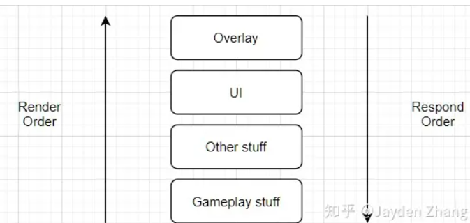

* 使用GLFW进行Windows下的窗口类设计

  ```cpp
  // Interface representing a desktop system based Window
  class Window
  {
      public:
      using EventCallbackFn = std::function<void(Event&)>;
  
      virtual ~Window() {}
  
      virtual void OnUpdate() = 0;
  
      // 获取窗体长宽参数
      virtual unsigned int GetWidth() const = 0;
      virtual unsigned int GetHeight() const = 0;
  
      // Window attributes
      // 窗口事件回调 + 双缓冲interval控制
      virtual void SetEventCallback(const EventCallbackFn& callback) = 0;
      virtual void SetVSync(bool enabled) = 0;
      virtual bool IsVSync() const = 0;
  
      virtual void* GetNativeWindow() const = 0;
  
      static Scope<Window> Create(const WindowProps& props = WindowProps());
  
  };
  ```

  在`WindowsWindow.cpp`中封装了GLFW的窗口事件回调。

* `Application.h`应用程序类，用于管理游戏引擎的启动与事件

  ```c++
Application::Application(const ApplicationSpecification& specification)
  		: m_Specification(specification)
  	{
  		AS_PROFILE_FUNCTION();
  
  		AS_CORE_ASSERT(!s_Instance, "Application already exists!");
  		s_Instance = this;
  
  		// Set working directory here
  		if (!m_Specification.WorkingDirectory.empty())
  			std::filesystem::current_path(m_Specification.WorkingDirectory);
  		
          // 创建GLFW窗口
  		m_Window = Window::Create(WindowProps(m_Specification.Name));
          // 设置交互事件回调
  		m_Window->SetEventCallback(AS_BIND_EVENT_FN(Application::OnEvent));
  		// 初始化渲染器
  		Renderer::Init();
  		// 创建ImGui层级并入栈(UI层)
  		m_ImGuiLayer = new ImGuiLayer();
  		PushOverlay(m_ImGuiLayer);
  	}
  ```
  
  

* 处理主线程窗口事件

  ```c++
  // 只有主窗口才需要监听事件
  void Application::ExecuteMainThreadQueue()
  {
      std::scoped_lock<std::mutex> lock(m_MainThreadQueueMutex);
  
      for (auto& func : m_MainThreadQueue)
          func();
  
      m_MainThreadQueue.clear();
  }
  ```

#### 1.3 窗口事件和输入事件封装

窗口事件枚举

```c++
enum class EventType
{
    None = 0,
    WindowClose, WindowResize, WindowFocus, WindowLostFocus, WindowMoved,
    AppTick, AppUpdate, AppRender,
    KeyPressed, KeyReleased, KeyTyped,
    MouseButtonPressed, MouseButtonReleased, MouseMoved, MouseScrolled
};

enum EventCategory
{
    None = 0,
    EventCategoryApplication = BIT(0),
    EventCategoryInput = BIT(1),
    EventCategoryKeyboard = BIT(2),
    EventCategoryMouse = BIT(3),
    EventCategoryMouseButton = BIT(4)
};

// #define BIT(x) (1 << x)
```

事件分发器

```c++
//Event.h
class EventDispatcher
{
    public:
    EventDispatcher(Event& event)
        : m_Event(event)
        {
        }

    // F will be deduced by the compiler
    template<typename T, typename F>
    bool Dispatch(const F& func)
    {
        if (m_Event.GetEventType() == T::GetStaticType())
        {
            m_Event.Handled |= func(static_cast<T&>(m_Event));
            return true;
        }
        return false;
    }
    private:
    Event& m_Event;
};

// Application.cpp dispatch调用
void Application::OnEvent(Event& e)
{
    EventDispatcher dispatcher(e);

    // 设置e.Handled为true + 绑定事件
    // OnWindowClose是函数名
    dispatcher.Dispatch<WindowCloseEvent>(BIND_EVENT_FN(OnWindowClose));
    dispatcher.Dispatch<WindowResizeEvent>(BIND_EVENT_FN(OnWindowResize));

    //AS_CORE_INFO("{0}", e);
	// 依次处理每个层级上的event
    for (auto it = m_LayerStack.end(); it != m_LayerStack.begin();)
    {
        (*--it)->OnEvent(e);
        if (e.Handled)
            break;
    }
}
```

输入类事件这里主要是键盘和鼠标。

#### 1.4 程序入口

先看入口程序（windows平台下的main函数）

```c++
#ifdef AS_PLATFORM_WINDOWS
	
//extern Aspect::Application* Aspect::CreateApplication();
extern Aspect::Application* Aspect::CreateApplication(ApplicationCommandLineArgs args);

int main(int argc,char** argv) {
	Aspect::Log::Init();
	AS_CORE_WARN("Hello Aspect Engine");

	// create
	AS_PROFILE_BEGIN_SESSION("Startup", "AspectProfile-Startup.json");
	//auto app = Aspect::CreateApplication();
	auto app = Aspect::CreateApplication({ argc, argv });
	AS_PROFILE_END_SESSION();

	// runtime
	AS_PROFILE_BEGIN_SESSION("Startup", "AspectProfile-Runtime.json");
	app->Run();
	AS_PROFILE_END_SESSION();
	
	// release
	AS_PROFILE_BEGIN_SESSION("Startup", "AspectProfile-Runtime.json");
	delete app;
	AS_PROFILE_END_SESSION();
	
}

#endif // AS_PLATFORM_WINDOWS
```

作为游戏引擎，Start Project设置为编辑器，`Aspectnut`

以下是`AspectEditorApp.cpp`

```c++
class Aspectnut : public Application
{
public:
	Aspectnut(const ApplicationSpecification& spec)
		: Application(spec)
	{
        // 创建一个编辑器层级
		PushLayer(new EditorLayer());
	}
	~Aspectnut()
	{}
};
// 在程序入口中调用
Application* CreateApplication(ApplicationCommandLineArgs args)
{
    // 创建编辑器Application
	ApplicationSpecification spec;
	spec.Name = "Aspectnut";
	spec.CommandLineArgs = args;

	return new Aspectnut(spec);
}
```

### 2. 渲染与用户交互界面 (Rendering&UI)

* 


以下引入imGui

涉及界面的显示，imGui窗口的管理

* 之前介绍了Aspectnut Layer，继承于编辑器层级，这里是UI层级

  ```c++
  // 用于对ImGui层级进行管理
  class ImGuiLayer : public Layer
  {
  public:
  	ImGuiLayer();
  	~ImGuiLayer() = default;
  
  	virtual void OnAttach() override;
  	virtual void OnDetach() override;
  	void Begin();
  	void End();
      // 事件监听
  	virtual void OnEvent(Event& event) override;
  
  	void BlockEvents(bool block) { m_BlockEvents = block; }
  
  	void SetDarkThemeColors();
  
  	uint32_t GetActiveWidgetID() const;
  private:
  	float m_Time = 0.0f;
  
  	bool m_BlockEvents = true;
  };
  ```

* UI层调用

  ```c++
  // EditorLayer::OnImGuiRender()在编辑器层渲染UI
  // 示例代码
  if (ImGui::BeginMenuBar())
  {
      if (ImGui::BeginMenu("File"))
      {
          if (ImGui::MenuItem("Open Project...", "Ctrl+O"))
              OpenProject();
  
          ImGui::Separator();
  
          if (ImGui::MenuItem("New Scene", "Ctrl+N"))
              NewScene();
  
          if (ImGui::MenuItem("Save Scene", "Ctrl+S"))
              SaveScene();
  
          if (ImGui::MenuItem("Save Scene As...", "Ctrl+Shift+S"))
              SaveSceneAs();
  
          ImGui::Separator();
  
          if (ImGui::MenuItem("Exit"))
              Application::Get().Close();
  
          ImGui::EndMenu();
      }
      if (ImGui::BeginMenu("Script"))
      {
          if (ImGui::MenuItem("Reload assembly", "Ctrl+R"))
              ScriptEngine::ReloadAssembly();
  
          ImGui::EndMenu();
      }
      if (ImGui::BeginMenu("Help"))
      {
          ImGui::MenuItem("Tutorial", NULL, &bShowTutorial);
          ImGui::MenuItem("About Me", NULL, &bShowAboutMe);
          ImGui::MenuItem("Demo ImGui", NULL, &bShowDemoImGui);
  
          ImGui::EndMenu();
      }
      ImGui::EndMenuBar();
  }
  
  // Application中定义了m_ImGuiLayer管理UI
  ```

  

#### 2.2 渲染器Renderer

AspectEngine中的渲染器设计。

**进行一次渲染的过程**

1. CPU准备数据并加载到显存中(VRAM)
2. CPU端设置渲染状态(渲染上下文)
3. 发起DrawCall指令，CPU开始渲染

```cpp
// Render.h设计
class Renderer {
public:
    // 1. 渲染器初始化
	static void Init();
    
    // 2. 调整窗口
	static void OnWindowResize(uint32_t width, uint32_t height);
    
    // 3. 开启场景渲染和关闭
	static void BeginScene(OrthographicCamera& camera);
	static void EndScene();
    
    // 4. 提交渲染指令
	static void Submit(const Ref<Shader>& shader, const Ref<VertexArray>& vertexArray, const glm::mat4& transform = glm::mat4(1.0f));

	inline static RendererAPIType GetAPI() { return RendererAPI::Current(); }
private:
	struct SceneData
	{
		glm::mat4 ViewProjectionMatrix;
	};
	static SceneData* m_SceneData;
};
```

以下是Submit函数

```cpp
void Renderer::Submit(const Ref<Shader>& shader,const Ref<VertexArray>& vertexArray,const glm::mat4& transform)
{
    // 1. 绑定shader
	shader->Bind();
	
	// 2. 向gpu发送数据供shader使用
	std::dynamic_pointer_cast<OpenGLShader>(shader)->UploadUniformMat4("u_ViewProjectionMatrix", m_SceneData->ViewProjectionMatrix);
	std::dynamic_pointer_cast<OpenGLShader>(shader)->UploadUniformMat4("u_Transform", transform);

    // 3. 绑定顶点数组对象，开始绘制
	vertexArray->Bind();
	RenderCommand::DrawIndexed(vertexArray);
}
```


以上是整体渲染器的设计，接下来是设计底层图形绘制，我们需要封装OpenGL来绘制想要的图形。

2D渲染器的示例

* 设计顶点数据结构(用四边形兼容三角形)

  ```cpp
  struct QuadVertex
  {
  	glm::vec3 Position;
  	glm::vec4 Color;
  	glm::vec2 TexCoord;
  	float TexIndex;
  	float TilingFactor;
  	
  	// Editor-only
  	int EntityID;
  };
  ```

* 渲染所需数据的结构体

  ```cpp
  struct Renderer2DData
  {
      // 1. 最大方形数量,顶点数量，索引数量(都是以方形绘制为基础)
  	static const uint32_t MaxQuads = 20000;
  	static const uint32_t MaxVertices = MaxQuads * 4;
  	static const uint32_t MaxIndices = MaxQuads * 6;
  	static const uint32_t MaxTextureSlots = 32; // TODO: RenderCaps
  
      // 2. 顶点数组+顶点缓冲+shader
  	Ref<VertexArray> QuadVertexArray;
  	Ref<VertexBuffer> QuadVertexBuffer;
  	Ref<Shader> QuadShader;
  
  	uint32_t QuadIndexCount = 0;
  	QuadVertex* QuadVertexBufferBase = nullptr;
  	QuadVertex* QuadVertexBufferPtr = nullptr;
  	
      // 3. 渲染器的数据分析
  	Renderer2D::Statistics Stats;
  
      // 4. 相机设计
  	struct CameraData
  	{
  		glm::mat4 ViewProjection;
  	};
  	CameraData CameraBuffer;
  	Ref<UniformBuffer> CameraUniformBuffer;
  };
  ```

* VAO+VBO+EBO/IBO的封装

  ```cpp
  // 1. VA 类，因为只要VBO和IBO设置好，可以直接通过VA来绘制，所以以VA类为主导设计
  class VertexArray 
  {
  public:
  	virtual ~VertexArray() = default;
  
  	virtual void Bind()const = 0;
  	virtual void Unbind()const = 0;
  
  	virtual const void AddVertexBuffer(const Ref<VertexBuffer>& vertexBuffer)  = 0;
  	virtual const void SetIndexBuffer(const Ref<IndexBuffer>& indexBuffer) = 0;
  
  	virtual const std::vector<Ref<VertexBuffer>>& GetVertexBuffers() = 0;
  	virtual const Ref<IndexBuffer>& GetIndexBuffer() = 0;
  
  	static Ref<VertexArray> Create();
  };
  
  // 2. VBO+ IBO
  class VertexBuffer
  {
  public:
  	virtual ~VertexBuffer() {}
  
  	virtual void Bind()const = 0;
  	virtual void Unbind()const = 0;
  
  	virtual const BufferLayout& GetLayout() const = 0;
  	virtual void SetLayout(const BufferLayout& layout) = 0;
  
  	virtual void SetData(const void* data, uint32_t size) = 0;
  
  	static Ref<VertexBuffer> Create(uint32_t size);
  	static Ref<VertexBuffer> Create(float* vertices, uint32_t size);
  };
  
  // support only for 32-bit buffers
  class IndexBuffer
  {
  public:
  	virtual ~IndexBuffer() {}
  
  	virtual void Bind()const = 0;
  	virtual void Unbind()const = 0;
  	virtual uint32_t GetCount() const = 0;
  	static Ref<IndexBuffer> Create(uint32_t* indices, uint32_t count);
  };
  ```

* 以下讲解代码具体绘制流程

  ```cpp
  // 1. 2d渲染器的数据，用这个对象管理渲染整个流程
  static Renderer2DData s_Data;
  
  // 2. 创建VA对象管理顶点数组
  s_Data.QuadVertexArray = VertexArray::Create();
  
  // 3. 创建VB对象管理顶点缓冲，绑定顶点缓冲，注意底层中 要先绑定vertexArray才能绑定vertexBuffer
  s_Data.QuadVertexBuffer = VertexBuffer::Create(s_Data.MaxVertices * sizeof(QuadVertex));
  s_Data.QuadVertexBuffer->SetLayout({
      { ShaderDataType::Float3, "a_Position"     },
      { ShaderDataType::Float4, "a_Color"        },
      { ShaderDataType::Float2, "a_TexCoord"     },
      { ShaderDataType::Float,  "a_TexIndex"     },
      { ShaderDataType::Float,  "a_TilingFactor" },
      { ShaderDataType::Int,    "a_EntityID"     }
  });
  s_Data.QuadVertexArray->AddVertexBuffer(s_Data.QuadVertexBuffer);
  
  //   顶点指针管理单顶点，用于遍历顶点数据
  s_Data.QuadVertexBufferBase = new QuadVertex[s_Data.MaxVertices];
  
  // 4. 创建IB对象，由于quad的indices可以确定，所以提前初始化好，同样注意在绑定indexBuffer(elementBuffer)前需要确保绑定vertexArray，这里也能体现出用VA类来管理两者的好处。
  uint32_t* quadIndices = new uint32_t[s_Data.MaxIndices];
  
  uint32_t offset = 0;
  for (uint32_t i = 0; i < s_Data.MaxIndices; i += 6)
  {
      quadIndices[i + 0] = offset + 0;
      quadIndices[i + 1] = offset + 1;
      quadIndices[i + 2] = offset + 2;
  
      quadIndices[i + 3] = offset + 2;
      quadIndices[i + 4] = offset + 3;
      quadIndices[i + 5] = offset + 0;
  
      offset += 4;
  }
  
  Ref<IndexBuffer> quadIB = IndexBuffer::Create(quadIndices, s_Data.MaxIndices);
  s_Data.QuadVertexArray->SetIndexBuffer(quadIB);
  delete[] quadIndices;
  ```

  **以下是具体的流程**

  1.  `Renderer2D::Init()`  创建VAO,VBO,IBO,Shader
  2. `Renderer2D::BeginScene` 设置相机属性，VP矩阵，初始化渲染数据
  3. ` Renderer2D::DrawQuad` 以绘制方形举例，由于**绘制**的指令由Renderer基类提出，这一部分的绘制本质上是对顶点数组进行装填数据，前面讲了VA,VB,IB的初始化，这样一来，但凡我们想要绘制新的四边形，只需要向顶点数组中装填就行，上层只用输入坐标A，形状B，变换C，颜色D等数据，就可以直接绘制出。
  3. `Renderer2D::EndScene` Flush绘制调用OpenGL绘制命令。
  
* 数据分析，每次申请的数组空间有限，如果绘制的顶点超过限制，放到下一次DrawCall(待补充)

#### 2.3 ImGui制作编辑器界面

参考：

1. [C++轻量级界面开发框架ImGUI介绍 - 知乎 (zhihu.com)](https://zhuanlan.zhihu.com/p/554775091)
2. [GUI(IMGUI)详解（含代码） - 知乎 (zhihu.com)](https://zhuanlan.zhihu.com/p/641279951)

ImGUI又称为Dear ImGui，它是与平台无关的C++轻量级跨平台图形界面库，没有任何第三方依赖，可以将ImGUI的源码直接加到项目中使用，也可以编译成dll, ImGUI使用DX或者OpenGL进行界面渲染，对于画面质量要求较高，例如客户端游戏，4k/8k视频播放时，用ImGUI是很好的选择


运作流程

```cpp
#include <imgui.h>
#include <imgui_impl_opengl3.h>
#include <imgui_impl_glfw.h>

int main()
{
    // 初始化GLFW窗口和OpenGL上下文
    
    // 初始化Dear ImGui
    ImGui::CreateContext();
    ImGuiIO& io = ImGui::GetIO();
    ImGui_ImplGlfw_InitForOpenGL(window, true);
    ImGui_ImplOpenGL3_Init("#version 330 core");
    ImGui::StyleColorsDark();
    
    while (!glfwWindowShouldClose(window))
    {
        // 处理输入事件
        glfwPollEvents();
        
        // 开始新的一帧
        ImGui_ImplOpenGL3_NewFrame();
        ImGui_ImplGlfw_NewFrame();
        ImGui::NewFrame();
        
        // 绘制GUI元素
        ImGui::Begin("Hello, World!");
        ImGui::Text("This is a simple GUI!");
        if (ImGui::Button("Click Me"))
        {
            // 当按钮被点击时执行操作
            // ...
        }
        ImGui::End();
        
        // 渲染GUI
        ImGui::Render();
        int display_w, display_h;
        glfwGetFramebufferSize(window, &display_w, &display_h);
        glViewport(0, 0, display_w, display_h);
        glClearColor(0.0f, 0.0f, 0.0f, 1.0f);
        glClear(GL_COLOR_BUFFER_BIT);
        ImGui_ImplOpenGL3_RenderDrawData(ImGui::GetDrawData());
        
        // 交换缓冲区
        glfwSwapBuffers(window);
    }
    
    // 清理资源
    ImGui_ImplOpenGL3_Shutdown();
    ImGui_ImplGlfw_Shutdown();
    ImGui::DestroyContext();
    
    // 关闭窗口和释放相关资源
    
    return 0;
}
```


### 3. Physics物理

参考：

1. [PhysX原理与实现：刚体碰撞 - 知乎 (zhihu.com)](https://zhuanlan.zhihu.com/p/353383540)

使用PhysX


### 4. ECS (entt)

参考：[Entt: 游戏满足现代C++——一种快速可靠的实体组件系统（ECS） - 我爱学习网 (5axxw.com)](https://www.5axxw.com/wiki/content/tkbsly)

### 5. Script(脚本系统)

使用c#作为脚本语言

参考：

1. [Unity C# 和 Mono - 知乎 (zhihu.com)](https://zhuanlan.zhihu.com/p/266037775#:~:text=Mono是什么？ Mono 是跨平台的.Net Framework 的实现。,Mono 做了一件很了不起的事情，将 CLR 在所有支持的平台上重新实现了一遍（包含手机上常用的安卓平台和Switch，PS4，这样的游戏机平台），并且mono还将.Net Framework 提供的基础类库也重新实现了一遍。)
2. [(41 封私信 / 81 条消息) 为什么叫.NET？它和C#是什么关系？ - 知乎 (zhihu.com)](https://www.zhihu.com/question/377803052)
3. [通俗易懂，什么是.NET?什么是.NET Framework？什么是.NET Core? - 小曾看世界 - 博客园 (cnblogs.com)](https://www.cnblogs.com/1996V/p/9037603.html#net1)

#### 5.1 使用C#实现跨平台

5.1.0**什么是.Net**

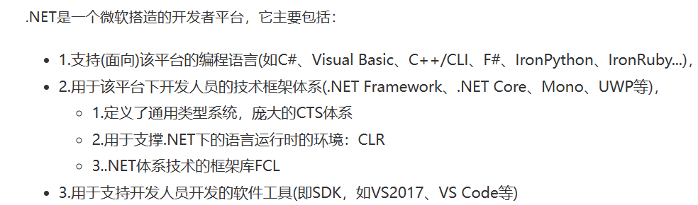

5.1.1**什么是.net framework**

* 最核心的运行库框架叫.Net Framework，它提供了新一代的面向互联网开发的API和相应SDK，终极目标是替换掉Win32 API，然而到现在也没替换掉。
* .NET Framework 是 Windows 的托管执行环境，可为其运行的应用提供各种服务。 它包括**两个主要组件**：公共语言运行时 (CLR)，它是**处理运行应用的执行引擎**；.**NET Framework 类库**，它提供开发人员可从其自己的应用中调用的已测试、可重用代码库。

5.1.2**如何实现跨平台**

C# 是微软推出的一种基于 .NET 框架的、面向对象的高级编程语言。

* 跨语言：即只要是面向.NET平台的编程语言((C#、Visual Basic、C++/CLI、Eiffel、F#、IronPython、IronRuby、PowerBuilder、Visual COBOL 以及 Windows PowerShell))，用其中一种语言编写的类型可以无缝地用在另一种语言编写的应用程序中的互操作性。
* 跨平台：一次编译，不需要任何代码修改，应用程序就可以运行在任意有.NET框架实现的平台上，即代码不依赖于操作系统，也不依赖硬件环境。


确切的说，跨平台的并不是C#这个语言，而是C# 编译后生成的中间语言（CIL，Common Intermediate Language，以前也叫 MSIL）**通用中间语言**，而CIL和平台无关。

微软系列动态语言都可以转换成该中间语言

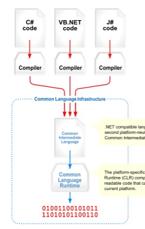


脚本语言被编译成CIL，然后CIL在通用语言运行平台下生成native code实现跨平台

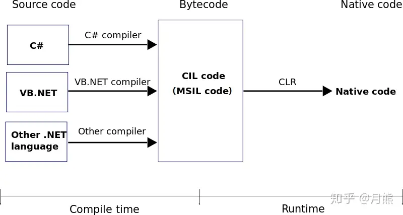


5.1.3**什么是mono**

Mono 基于是跨平台的 .Net Framework 的实现。

Mono将 CLR 在所有支持的平台上重新实现了一遍（包含手机上常用的安卓平台和Switch，PS4，这样的游戏机平台），并且mono还将 .Net Framework 提供的基础类库也重新实现了一遍。

**以下是c++调用Mono示例代码**

```c++
#include <mono/jit/jit.h>
#include <mono/metadata/assembly.h>
#include <mono/metadata/class.h>
#include <mono/metadata/debug-helpers.h>
#include <mono/metadata/mono-config.h>

MonoDomain *domain;

int main()
{
	// Program.cs所编译dll所在的位置
	const char* managed_binary_path = "Program.dll";
    //获取应用域
    domain = mono_jit_init("Test");

    //加载程序集ManagedLibrary.dll
    MonoAssembly* assembly = mono_domain_assembly_open(domain, managed_binary_path);
    MonoImage* image = mono_assembly_get_image(assembly);

    // =====================================================准备调用
    //获取MonoClass,类似于反射
    MonoClass* main_class = mono_class_from_name(image,"MonoCsharp", "MainTest");

    //获取要调用的MonoMethodDesc,主要调用过程
    MonoMethodDesc* entry_point_method_desc = mono_method_desc_new("MonoCsharp.MainTest:Main()", true);
    MonoMethod* entry_point_method = mono_method_desc_search_in_class(entry_point_method_desc, main_class);
    mono_method_desc_free(entry_point_method_desc);
    //调用方法
    mono_runtime_invoke(entry_point_method, NULL, NULL, NULL);
    //释放应用域
    mono_jit_cleanup(domain);

    return 0;
}
```


## Bug或需要注意问题

* 根目录下的.editconfig配置了文本的编码，(Tool->options->c++->code style->editconfig)

  由于vs默认编码为GBK，不利于跨平台，为了方便编写(复制)代码，提前配置好，重新premake5一下项目就能统一每个文件，不然很有可能运行 unsolved external symbols

## 详细介绍UTF-8及其它编码，如何编写.editorconfig

[UTF-8 BOM踩坑记——细说Unicode和UTF-8 - 掘金 (juejin.cn)](https://juejin.cn/post/6884571798751412238)

[一篇文章说清楚文件编码（utf8，gbk，Unicode，ASCII） - 知乎 (zhihu.com)](https://zhuanlan.zhihu.com/p/343747149#:~:text=目前常见的文件编码 1 ASCII编码，8bit（一个字节），能表示的最大的整数就是255（2^8-1%3D255），而ASCII编码，占用0 - 127用来表示大小写英文字母、数字和一些符号，这个编码表被称为ASCII编码，比如大写字母A的编码是65，小写字母z的编码是122。 还对一些如'\n'，'\t'，'%23'，'%40'等字符进行了编码。 2 GB2312编码，16bit,个码位。 ... 4 Unicode 编码，通常16bit (2个字节），为了统一所有文字的编码，Unicode应运而生，这是一种所有符号的编码。 ... 更多项目)

## Review

主要feature

* renderer
* platform
  * opengl
  * vulkan
* ui
  * imgui
* asset manager
* script
* physics&others


