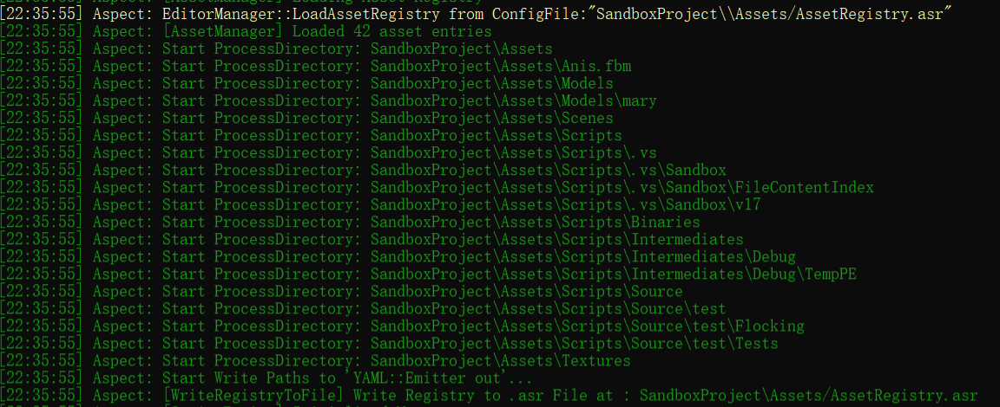

# AspectuxEngine


## Introduction

I really learned a lot from github and some excellent open source authors or video makers。

This is my first game engine and the last one as well of my undergraduate life.


It is a game engine based on opengl.

I don't know whether it will support DX11/12 or Vulkan in the future,it depends...

The engine contents are as follows.

## Contents

### 2d/3d Renderer,Editor


console


### Resources Management and Serialization System



### Script System

**Based on Mono**, just some basic functions are implemented

example of position change

```c#
using System;
using System.Collections.Generic;
using System.Linq;
using System.Text;
using System.Threading.Tasks;

using Aspect;

namespace Sandbox
{
	public class testMove : Entity
	{
		private TransformComponent m_Transform;
		//private Rigidbody2DComponent m_Rigidbody;

		public float Speed = 10.0f;
		public float Time = 0.0f;

		void OnCreate()
		{
			Console.WriteLine($"Player.OnCreate - {ID}");

			int testvalue = 10;
			Log.Info($"Test For console, testvalue: {0}", testvalue);

			m_Transform = GetComponent<TransformComponent>();
		}

		void OnUpdate(float ts)
		{
			Time += ts;
			Console.WriteLine($"Player.OnUpdate: {ts}");

			float speed = Speed;
			Vector3 velocity = Vector3.Zero;
			/*
			if (Input.IsKeyDown(KeyCode.W))
				velocity.Y = 1.0f;
			else if (Input.IsKeyDown(KeyCode.S))
				velocity.Y = -1.0f;

			if (Input.IsKeyDown(KeyCode.A))
				velocity.X = -1.0f;
			else if (Input.IsKeyDown(KeyCode.D))
				velocity.X = 1.0f;
			
			Entity cameraEntity = FindEntityByName("Camera");
			if (cameraEntity != null)
			{
				Camera camera = cameraEntity.As<Camera>();

				if (Input.IsKeyDown(KeyCode.Q))
					camera.DistanceFromPlayer += speed * 2.0f * ts;
				else if (Input.IsKeyDown(KeyCode.E))
					camera.DistanceFromPlayer -= speed * 2.0f * ts;
			}*/
			velocity.X = speed;
			//m_Rigidbody.ApplyLinearImpulse(velocity.XY, true);

			Vector3 translation = m_Transform.Translation;
			translation += velocity * ts;
			m_Transform.Translation = translation;
		}

	}
}

```

put a script component to this entity


### Physics

Based on bullet

## My Notes

[Click here](Documentation/如何从零开发游戏引擎.md)

## Credits

* [TheCherno/Hazel]([TheCherno/Hazel: Hazel Engine (github.com)](https://github.com/TheCherno/Hazel))
* [hebohang/HEngine]([hebohang/HEngine: HEngine - 2D/3D Game Engine written in C++20 (github.com)](https://github.com/hebohang/HEngine))
* [BoomingTech/Piccolo]([BoomingTech/Piccolo: Piccolo (formerly Pilot) – mini game engine for games104 (github.com)](https://github.com/BoomingTech/Piccolo))
* [adriengivry/Overload]([adriengivry/Overload: 3D Game engine with editor (github.com)](https://github.com/adriengivry/Overload))
* [LearnOpengl](https://learnopengl-cn.github.io/)
* Games101/Games202
